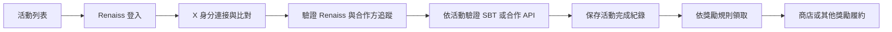

# Renaiss Merch 任務模式與上線方案

原規劃日期：2026-09-29；X App 設定更新於 2026-09-30。以下保留當時的提案與程式觀察。2026-10-06 已新增 Surf 任務的 OAuth、查核與持久化，並完成真實 Renaiss／X 本機流程；最新配置與未完成項目以 [Surf 任務串接](surf-missions-integration.md) 為準。Surf 的實際任務沒有「追蹤 Renaiss」條件。

本文件依照目前 Merch、football 程式碼，以及本次查閱的官方文件整理。截圖是產品背景；其中他人的說法不視為部署或獎勵發放授權。已依使用者後續指示建立 Merch 專用 X Developer App；沒有修改應用程式、push、部署或發放獎勵。

「互相 follow」暫按參加者的 X 帳號同時追蹤 Renaiss 與合作專案規劃。若實際需求是兩個官方帳號彼此追蹤，需另設專案帳號驗證；不能拿參加者的 X token 推論任意兩個第三方帳號的關係。

## 1. 產品方向

保留既有商店作為 Merch 主入口，從商店進入任務與我的獎勵。任務負責活動參與與驗證，商店負責商品展示及兌換，我的獎勵顯示取得的資格與領取進度。

第一個可交付版本是一個完整聯名活動：參加者登入 Renaiss，連接其 Renaiss 綁定的 X，完成追蹤 Renaiss、追蹤合作方兩項任務，取得活動完成紀錄。活動可選擇再加入 SBT 門檻或合作方的 API 條件。

建議既有商品繼續依現行 SBT 規則領取；新活動另外設定獎勵。追蹤任務不會直接增加鏈上 SBT，也不會自動授予既有商品。SBT mint、抽獎、折扣或實體商品發放，需要各自明確的獎勵規則與執行模組。

## 2. 現有程式提供了哪些基礎

以下是本機目前程式的觀察，不代表線上部署狀態。

| 能力 | 現有位置 | 評估 |
| --- | --- | --- |
| Renaiss OIDC、PKCE、身分正規化 | `server/oidc.mjs`、`server/index.mjs` | 可沿用登入；正規化資料有 `sub`、Safe wallet、Twitter username，沒有 numeric X user ID 或 X read token |
| 商店 session | `server/session-store.mjs` | session 與 OAuth challenge 存在記憶體 Map；重啟會失效，跨 instance 不共用 |
| 商品 SBT 資格 | `server/eligibility.mjs`、`server/sbt-dual-source.mjs` | 可作任務驗證來源；目前票券 20、T-shirt 40、Bracelet 100 個 SBT badge |
| 商品、寄送、VIP 領取 | `server/shipping-claims.mjs`、`server/vip-ticket-claims.mjs` | 可沿用履約；要在授權層明確接入新活動的獎勵類型 |
| 既有商品永久權益 | `server/merch-product-entitlements.mjs` | 目前來源是已提交／舊版領取紀錄，key 是 wallet + product；不能直接用它代表任務完成 |
| 資料庫 | `server/merch-database.mjs` | 已使用 SQLite、WAL 與交易，能支援單 instance 第一版 |
| 庫存 | `server/merch-inventory.mjs` | 目前明確設上限的商品是 Bracelet，數量 20；不能推論所有活動獎勵已具備通用庫存 |
| 前端入口 | `src/App.tsx`、`src/components/MerchStore/` | 現有主要 view 是 landing/store；新增任務 route 與共用 session hook，避免把任務流程全部塞入 MerchStore |
| 任務與活動 | 本次搜尋 `src/`、`server/`、`shared/` | 未找到已實作的 campaign/task engine、X connect 或 TaskOn/QuestN adapter |

### football：兩種 X 驗證要分清楚

`/Users/gavin/renaiss_bnb_football/scripts/auth/x-follow-gate.mjs` 是互動式追蹤驗證：

1. 由 Renaiss 登入的 wallet 身分開始。
2. 使用者另做 X OAuth connect；`scripts/auth/routes.mjs` 目前預設 scope 為 `users.read follows.read offline.access`。
3. `scripts/auth/user-profile-store.mjs` 比對 Renaiss 綁定的 X 與 X OAuth 身分。
4. 以使用者 X access token 查目標帳號，要求 `user.fields=connection_status,username,name`。
5. 檢查 `connection_status` 是否包含 `following`，並保存驗證紀錄。
6. `scripts/auth/oauth-token-store.mjs` 示範 token 加密儲存與更新。

這是最適合移植的能力，但需拆開 X client、身分綁定、活動規則與儲存責任。原模組依賴 football 的 session/profile/JSON store，不能直接複製後就認為可在 Merch 運作。

`/Users/gavin/renaiss_bnb_football/src/syncFollowers.js` 則是背景粉絲名單同步，CLI verify 查的是本機 cache。delta sync 不可靠地辨識取消追蹤；cache lookup 回傳的 `checkedAt` 是查詢 cache 時間，不是 X 最新查核時間。它適合營運分析，不作新任務的即時領獎依據。

### 移植前要修正的語意

- 原 gate 一次使用一個全域 target handle。新任務要支援每活動、多個 target，以及發布後固定的規則版本。
- 原 gate 已 `verified` 時直接沿用成功，沒有成功紀錄的 TTL。新活動要區分歷史完成、目前資格與已發出的獎勵。
- 原程式把缺少或無效的 `connection_status` 轉成空陣列，再判成 `not_following`。新 client 必須區分「有效空陣列＝沒有追蹤關係」與「缺欄位／部分 API error＝無法驗證」。
- 原 gate 有本機測試 skip，production 設定會限制它。這是現有測試繞過機制，正式任務不可把 skipped/demo 當成 verified，也不能接入領獎。
- 原 API fetch 沒有明確的請求 timeout；新 client 要有 timeout、429 冷卻、token 重新授權與額度不足狀態。
- football 程式的預設 scope 少了 `tweet.read`，而目前官方 authentication mapping 對 user lookup／`users/me` 列出 `tweet.read users.read`。這是移植前要核對的差異；正式環境可能已用 `X_OAUTH_SCOPE` 覆寫，不能據此斷言 football 線上功能故障。[X 官方 auth mapping](https://docs.x.com/fundamentals/authentication/guides/v2-authentication-mapping)

上述是既有簡化或測試機制的盤點。本輪沒有新增 fallback。

## 3. 使用者看到的第一版

活動列表提供合作方、截止時間、獎勵、所需步驟與自己的完成進度；未登入也能瀏覽公開活動規則。

活動詳情依序呈現：

1. 登入 Renaiss。
2. 顯示目前綁定的 X，連接並驗證同一帳號；若不同，明確請使用者重新連接或更新 Renaiss 綁定。
3. 「追蹤 Renaiss」與「追蹤合作方」各自有前往 X、驗證與結果。
4. 如活動需要 SBT 或合作產品使用紀錄，顯示該條件與其驗證結果。
5. 條件全部通過，顯示活動完成；若已設定獎勵，另提供明確的領取入口。

完成歷史與可領取狀態分開。X 限流或服務失效顯示「暫時無法驗證／何時可重試」，不能顯示成未追蹤，更不能通過。部分任務失敗時保留其他任務的結果與查核時間。



第一版使用明確的活動設定檔及小型活動 UI。後續新增合作方主要改活動設定；開始大量營運時再加建立活動、預覽、發布與稽核的管理介面。

## 4. 驗證引擎與身分

任務類型先做 `x.follow`，按活動需要加入 `sbt.minimum` 與 `partner.api`。每個 verifier 回傳結構化的結果、證據來源、查核時間與失敗原因；引擎依發布的規則判斷活動是否完成。

以 Renaiss `sub` 作站內參加者 ID，Safe wallet 作已驗證的鏈上／履約地址，numeric X user ID 作社群身分。handle 只用於展示和初次解析。合作方 X ID 在活動發布前解析並固定，避免改名或同名替換改變任務對象。

Renaiss 現有的 `twitterUsername` 是連結資料，並不帶可讀 X 追蹤的 token。Merch 仍要加入獨立 X OAuth connect；使用者通常要授權一次，之後在有效授權期間可驗不同合作方。正式 scope 以 `tweet.read users.read follows.read offline.access` 作為候選，按照選用 endpoint、關係欄位與實際 Developer app 授權實測確認，不直接假設 football 的預設已足夠。

X callback challenge 綁定當前 Renaiss session 與 user sub，使用 PKCE/state，callback 再確認身分仍相同。token 僅由後端加密保存，前端不得提供待驗證的 X user ID 或任意目標 URL。

### Merch X App（2026-09-30 原始設定）

2026-09-30 在 X Developer Console 建立 `renaiss-merch` App（App ID `33484488`），連到現有 Pay Per Use project 的 Production environment。OAuth 設定為 Web App confidential client、Read 權限，不要求使用者 email；網站網址是 `https://merch.renaisscltb.com/`，已登記精確回呼 `https://merch.renaisscltb.com/auth/x/callback`。Merch 正式網域由 Zeabur 該服務的公有網路設定確認。

一次性 App/OAuth 憑證只存在本機 Git 忽略的 `.secrets/x-merch-app/`，檔案及目錄權限限制為擁有者讀寫；沒有寫入 repo 或 Zeabur。OAuth 2.0 的 client ID/secret 是後續 Web App 串接所需；OAuth 1.0 consumer key/secret 與 app-only bearer token 也已留存，但不應因其存在就改用 app-only token 推斷任意使用者的追蹤關係。

2026-09-30 時 `/auth/x/callback` 尚無 handler。2026-10-06 已掛接 handler、配置本機 OAuth 2.0 憑證並實際完成授權／查核；正式部署環境仍未配置此次新增變數。

當時建議的 `connection_status` 在 2026-10-06 真實 Surf 查詢會被省略，目前改用完整官方 following 清單作唯一查核來源。詳見最新串接文件；不能用 app-only token 代表參加者，也不能把欄位缺席判成未追蹤。

重複查核可合併同一 user/target 的同時請求，並使用短期有效結果降低成本；每個任務另外記錄自身規則版本。API 請求數和回傳資源費用是不同計量，正式預算以實際 X app 的方案及用量確認。[X Developer Platform](https://docs.x.com/overview)

### 建議的第一版資格規則，待產品確認

- 公開活動允許無 SBT 使用者參加；有需要的活動再加 SBT 任務。
- 每活動每個 Renaiss sub 只能取得一次完成獎勵；numeric X ID 在同一活動只能綁定一名參加者，阻止同一 X 搭配不同站內身分重複領取。
- follow 驗證建議短期有效，領獎時若結果過期就重新驗證；具體 TTL 由活動設定，不在程式硬寫成永久通過。
- 新授權身分、目標或規則改變時，舊證據不得自動套用。
- 已發出的獎勵保留獨立紀錄；是否要求持續追蹤及能否撤銷，需在活動發布前明訂。

## 5. 資料與程式拆分

建議在目前資料庫新增 migration，分開保存：

| 資料 | 責任 |
| --- | --- |
| `auth_sessions` / `oauth_challenges` | 支援 session/challenge 持久化與重啟後續接；避免任務綁定因部署失效 |
| `social_connections` | sub、numeric X ID、handle、加密授權、連結版本、撤銷狀態 |
| `campaigns` / `campaign_tasks` | 開始／截止、合作方、任務類型、固定 target IDs、發布版本、獎勵規則 |
| `task_verification_attempts` | 每次成功、未完成、無法驗證的證據與時間，避免只覆寫最後一次狀態 |
| `campaign_completions` | 與特定規則版本對應的歷史完成 |
| `reward_grants` | 獎勵授予、去重及狀態；與既有 submitted claim 權益分開 |
| `integration_receipts` | 外部事件與查核紀錄、去重、來源與處理狀態 |

獎勵交易要重新確認有效證據、活動時間、身分版本與可用庫存，使用唯一約束及交易避免雙擊或並行請求重複領取。先在交易外取得上游證據，交易內再次檢查版本與有效期限；不把網路等待放進 SQLite 寫入交易。

任務獎勵若要接到商品，需讓商品 access、claim、private-media guard 一起辨識明確的 reward grant。不能只顯示解鎖卡片，也不能把任務獎勵寫成 `submitted_claim` 而誤認已提交寄送資料。獎勵 grant 與 claim submission 在同一資料模型中建立清楚的關聯。

```text
shared/missions/                任務、活動與獎勵的共用定義
server/auth/x/                  X config、connect/callback、client、token store
server/missions/                routes、campaign rules、repository、service
server/missions/verifiers/      x-follow、sbt、partner-api
server/rewards/                 獎勵資格、去重、grant 與商店接點
server/integrations/taskon/     TaskOn 契約及驗證 adapter
server/integrations/questn/     契約確認後才建立
src/components/Missions/       活動列表、詳情、任務步驟
src/components/Rewards/        獎勵狀態與領取入口
src/lib/missions/              API client 與型別
```

SQLite 可支援有持久磁碟的單 instance 第一版。若要多副本或跨站共享驗證服務，再遷移到共同資料庫；不能讓各副本依賴獨立 SQLite/Map。各站不得共用 cookie 或 token 檔案作為整合方式。

任務入口獨立載入，不應要求使用者等商店五支 reveal MP4 下載完才看到活動。商店在可見時繼續執行既有匿名預載與 Cache Storage 流程。

## 6. TaskOn / QuestN 的接法

建議先由 Renaiss 站內保存權威任務結果，外部平台負責活動曝光與導流。TaskOn 可設追蹤任務，再加「完成 Renaiss 活動」的 API 任務；Renaiss 後端提供只讀完成查詢，平台依它的契約讀取結果。這樣站內商店與履約不依賴平台前端狀態。

TaskOn 官方文件確認 API task 可按社群帳號或 wallet 作查詢，也區分 completion 與 performance 任務。它們的回傳契約不能互換；正式 adapter 需依實際 campaign dashboard 的 API Standards Specification 確認。[TaskOn API Task](https://taskoncommunitys-organization.gitbook.io/entity-hub-for-business-end/community-hub/set-up-community-tasks/api-task)

外部查詢識別字必須能映射到站內已驗證的身分。參加者在平台連的外部 EOA 與 Renaiss Safe wallet 可能不同；不能直接當作同一地址。第一版可優先評估以已綁定 X 身分作只讀查詢；若要 EOA 對 Safe mapping，另外加入明確的所有權驗證。

外部 lookup 只查已存在的有效紀錄，不接受用任意查詢參數完成 X 綁定、發獎或觸發無上限 X API 查詢。依平台能力加後端驗證憑證與限流，避免暴露其他個人資料。查詢失效或來源無法確認時不回報完成。

TaskOn 另有嵌入 SDK，但需要向 TaskOn 取得 embed credentials／域名設定；其 wallet flow 需要 provider，不可假設 Renaiss OIDC 的 Safe wallet 字串直接滿足。[TaskOn SDK 入門](https://taskon-xyz.github.io/taskon-embed/guide/getting-started.html)

若後續接 webhook，SDK 的 `taskCompleted` 前端事件只用來刷新畫面。官方 webhook 示例的 HMAC 只涵蓋 `timestamp` 和 `user_id`，不能稱為整個 task/reward/address payload 已簽章；需結合服務端來源查核、預先核定的任務／獎勵映射、時間窗口和去重，再決定授予權益。[TaskOn webhook 文件](https://taskon-xyz.github.io/taskon-embed/guide/webhooks.html)

QuestN 本次只取得官方首頁的功能資訊，文件入口無法成功讀取，未確認 API、webhook、認證或費用契約。先列為第二個獨立 adapter 的待確認項目；不宣稱已具備與 TaskOn 相同的串接能力。[QuestN 官方網站](https://www.questn.com/)

## 7. 上線分期與完成條件

### A. 商店正式入口

Zeabur Merch 服務的公有網域已確認為 `merch.renaisscltb.com`。正式上線仍需確認 Renaiss callback allowlist、repo/branch、persistent volume 與公開／私有 CDN release。由設定明確切到 `MERCH_STOREFRONT_MODE=production`，主路徑顯示新 Store、`/v1.2/` canonical redirect 保留 query，舊版入口不可公開存取，Demo API 與既有 Demo session 均不可取得正式權益。

本機 `.env.local` 目前是 `preview`；本輪沒有讀取 Zeabur 生效設定，因此未確認正式站的 storefront mode。不要把這個本機值當成正式站狀態。

### B. 站內聯名任務第一版

先實作一個合作活動、兩個 follow 任務、X connect、持久化結果與防重複完成。預設以活動完成紀錄交付；選定實際獎勵後加入該類型的領取及履約。若第一場活動要求 SBT 或合作 API，在同一框架加入對應 verifier。

發布前活動必須具備真實合作方帳號、時間、獎勵規則與庫存。未確定的範例只能出現在本機預覽，不可作為可參加的正式活動。

### C. 外部平台活動

先實際設定並驗收一個 TaskOn API task，確認正常、未完成、未知識別字、過期與平台重試行為。QuestN 契約確認後再接。若要白標 SDK 或平台發獎同步，作為額外範圍。

### 必須驗收的案例

| 案例 | 預期 |
| --- | --- |
| 兩個都沒追蹤／只追蹤其一／兩個都追蹤 | 各任務結果正確，全數必要條件通過才完成活動 |
| Renaiss 與 X OAuth 帳號不一致 | 無法建立此活動的有效驗證 |
| token 過期／授權撤銷 | 更新 token 或要求重新連接，不以舊授權假裝可查核 |
| X 429／402／timeout／缺欄位／部分 error | 顯示可區別的無法驗證狀態，不發獎 |
| 取消追蹤後使用過期結果領獎 | 重新查核；歷史完成不等於當下資格 |
| 不同 sub 使用同一 X ID 參加同一活動 | 依預先發布的去重規則阻止重複獎勵 |
| 雙擊、並行請求、刷新後再領 | 同一獎勵只建立一次 grant，claim/inventory 保持一致 |
| 活動截止／規則版本更新 | 舊證據不跨版本授權，新領取符合發布的時間規則 |
| API 任務／webhook 未知來源或重放 | 不能建立任務證據或重複授予獎勵 |
| 重啟服務／重新登入 | 任務紀錄和 grant 保留；session 按設計續接，重新授權不重複發獎 |
| production 下 Demo 或測試 skip | 正式驗證與獎勵 API 拒絕 |

測試使用獨立資料庫與已允許的測試帳號，不碰正式領取紀錄。本次未新增或刪除測試檔；實作期的臨時測試用完，按專案規則先告知刪除清單再清理，保留實際驗收結果。

### 部署驗收

- Build 的 JS/CSS chunk 及媒體大小 audit；所有公開媒體直接交付 R2/CDN，source/concept/AI 工作素材不進 public/dist。
- Public hashed assets 驗證 immutable cache；JS/CSS 驗證 gzip/brotli；HTML/API/auth/callback 不長快取。
- 五支公開 reveal MP4 保持匿名直連 CDN、Range/206、Content-Length/Type/ETag；刷新與登出登入後不重下載相同 bytes。
- 私有 product/claim 媒體經 Zeabur 判權後 307 到短期簽署 Cloudflare URL；資料本體不經 Zeabur，不加本機串流 production fallback。
- Zeabur GitHub source 使用指定 branch 與 repo Dockerfile，`spec.source.dockerfile === null`；build log 確認 clone 與 Dockerfile 載入。
- 新 deployment RUNNING、`/healthz`、live HTML/API/header/timing、手機與桌面瀏覽器實際流程各自驗證。
- Push 前完成可審查的變更與 `git diff --check`，依專案規則取得使用者明確同意；push 成功與線上驗收分開回報。

## 8. 實作前需要確定的營運資訊

第一個合作方的 X 帳號、活動期限、活動獎勵與數量、是否需要 SBT 門檻、以及追蹤條件只在完成時要求或領獎時也要求。技術面已確認 Merch 正式 origin 及 X Developer App 的 callback/read 設定；仍需實際授權確認 OAuth scope、follow API 可用性與額度，以及 TaskOn campaign/必要的整合憑證。

以上尚未確認的資訊不妨礙先做站內驗證框架與本機活動介面；正式發布與發獎需使用已確定的真實設定。

## 9. 本輪驗證範圍

已閱讀兩個 repo 的相關來源程式與 AGENTS.md、Merch 媒體／部署設定、以及 X、TaskOn 官方文件，並由 Aside 確認 Zeabur 公有網域與 X App OAuth 設定。沒有以真人帳號完成 X 授權／follow API 呼叫，沒有執行 build 或新增測試，沒有確認線上 storefront mode 與 CDN 的現在狀態。因此本文件是有程式依據的實作規劃，並非功能或部署已通過的驗收紀錄。
